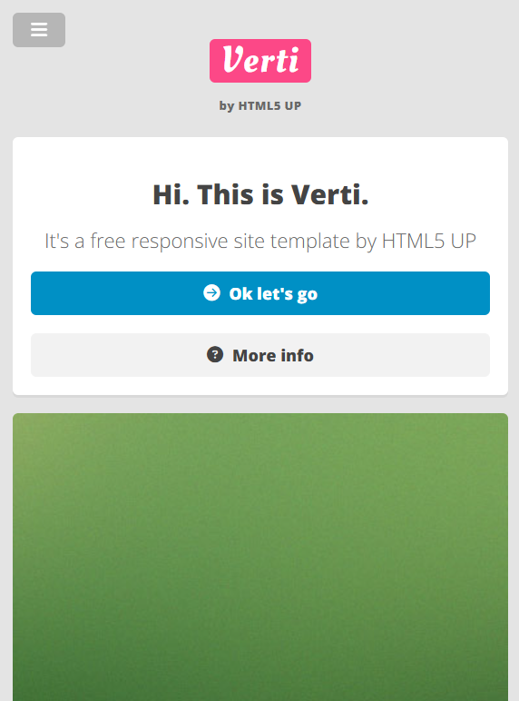
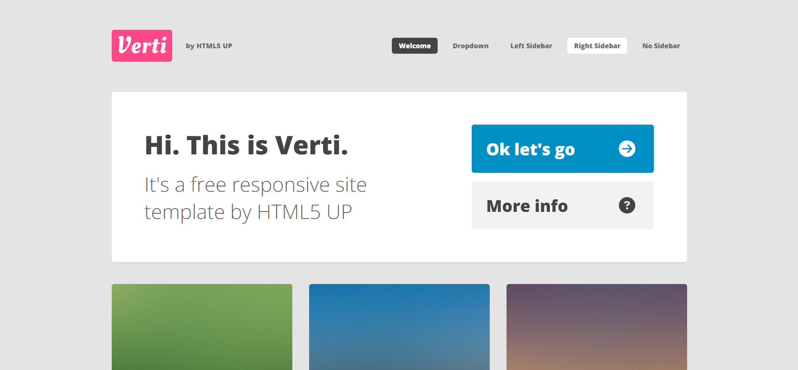
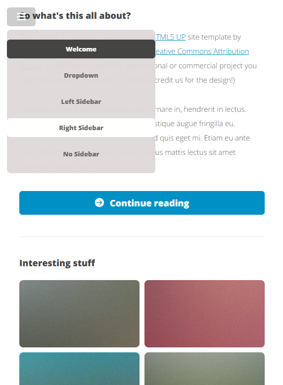
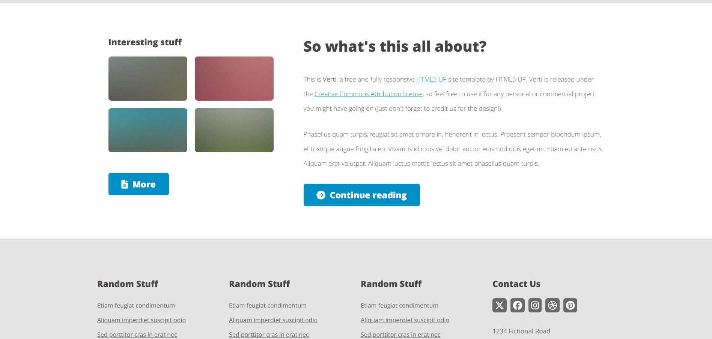

# 🧑‍💻 Verti

This project was created as an exercise during the JavaScript Developer course, in the Sass and RWD module. It
is a one-page website built entirely from scratch, based on a layout designed in Adobe XD.

**Available online at:**  
[https://verti-project.netlify.app](https://verti-project.netlify.app)

## 🚀 Features

- Basic layout and UI design
- Responsive Web Design (Mobile First)

## 📸 Screenshots

Below are example screenshots of the Verti app on desktop and mobile devices.

### View 1

### View 2

## 🛠️ Technologies

- Vite
- SCSS (modular architecture with @use instead of legacy @import)
- Responsive Web Design (Mobile First)

## 🔧 Local Installation

1. **Create a local folder named `verti` on your device**

   This will be the place to copy the repository.

2. **Clone the application into the created folder**

   Use the command `git clone` to download the repository:

   `git clone https://github.com/Your-Account/Verti.git`

3. **Navigate to the main folder in the terminal**

   Go to the project directory to be able to run npm commands:

   `cd Verti`

4. **Install the application**

   Install all required dependencies:

   `npm install`

5. **Run the app in development mode**

   To run the app in dev mode, use:

   `npm run dev`

6. **Build the app for production (optional)**

   Prepare the app for deployment in production:

   `npm run build`

## 🧾 Usage Instructions

⚠️ This project is a course exercise and is not a fully functional application.

For now, you can:

- Explore the UI and layout,
- Navigate through example sections,
- Get familiar with the project structure.
